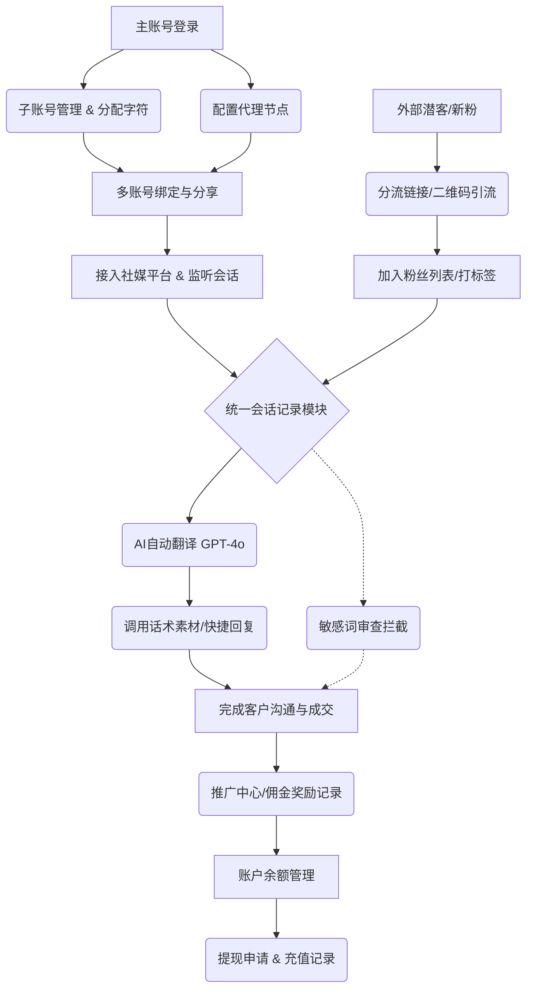

项目名称：NexSCRM（商户端）

项目背景：
NexSCRM 是一款专为跨国创业者、海外社媒运营者设计的营销型客户端软件。
其核心出发点在于：随着全球化创业和跨境电商的发展，运营者通常需要同时管理多个海外社交媒体账号（如 WhatsApp、Telegram、Line、Signal 等），面临多账号切换繁琐、跨语言沟通障碍、粉丝管理分散等痛点。NexSCRM 旨在通过“账户多开群控”能力，让运营者一人即可高效管理 100+ 个社交账号，并通过 AI 翻译、自动化营销等工具，实现跨平台、跨语言的统一运营。
主要适用场景包括：海外社媒运营、跨语言沟通、多账号矩阵管理、粉丝承接与客户跟进

## 一、 核心端到端业务流程
> **系统定位：** 该系统是一个集成“多账号群控、AI实时翻译、自动化营销与推广分销”的海外社媒运营管理后台。
> **通用业务故事线：** 系统采用 **“配置 -> 引流 -> 触达 -> 转化 -> 结算”** 的核心路径。

### 1. 文字版业务流
*   **① 基础环境配置：** 主账号登录系统，进入【子账号管理】创建并分配子账号，同时在【代理管理】中配置全局或单账号的网络代理IP，以防止多账号关联封号。在【字符分配记录】中为子账号划拨AI翻译所需的字符额度。
*   **② 素材与规则预设：** 在正式运营前，管理员在【话术素材库】上传图文/视频素材，在【快捷回复】和【关键词回复】中预设标准化话术和自动应答规则（支持定时回复和分组策略）。
*   **③ 多渠道引流与获客：** 通过【多账号分享】将绑定好的社媒账号（WhatsApp, Telegram等）分配给客服子账号。同时通过【分流管理】生成专属引流链接/二维码，结合【底粉管理】中导入的潜在客户数据进行冷启动拓客。
*   **④ 统一客服沟通与AI翻译（核心转化）：** 粉丝进入私信后，子账号客服在【会话记录】中统一管理跨平台消息。系统自动调用 **GPT4o-mini** 进行“源语言自动检测”与“目标语言翻译”，实现零障碍跨国沟通。客服可随时调用快捷回复和素材库进行快速应答。
*   **⑤ 敏感词风控与过滤：** 在【敏感词】模块设置拦截词库，对沟通中的违规发送内容进行拦截与记录，保障账号安全。
*   **⑥ 推广分销与资金结算：** 如客户成交，子账号可触发【推广中心】的奖励机制（首次交易奖励15%，后续交易奖励10%）。推广业绩会在【推广报表】中展示。最终，推广者可在【我的账户】中查看USDT余额，并根据规则（3个工作日内到账，手续费1%）发起【申请提现】。

### 2. Mermaid 业务流转图
*(可直接输入给AI加载渲染)*

---

## 二、 系统模块交互与架构说明

该系统大致分为 **6大核心功能域**，彼此间的依赖关系、数据流向及事务边界如下：

### 1. 账户与资源中心（核心身份与权限）
*   **包含模块：** 子账号管理、字符使用记录、字符分配记录、个人资料。
*   **交互关系：** 其他所有业务模块（如会话记录、快捷回复）在发起操作前，必须先依赖“子账号管理”模块进行**身份校验**和**权限判定**。
*   **事务边界：** “字符分配记录”涉及**资源强一致性**的事务边界，主账号的剩余字符数更新与子账号的增加字符数必须在同一个数据库事务中完成，避免资源凭空消失或超额分配。

### 2. 基础设施与连接层（底层支撑）
*   **包含模块：** 代理管理、多账号分享、平台工单。
*   **交互关系：** “多账号分享”和“平台工单”负责与WhatsApp、Telegram等第三方平台的外部API进行Socket或Webhook通信。该模块强依赖“代理管理”提供的IP池，代理模块负责维护网络连接池和连接状态。
*   **事务边界：** 工单状态切换（如“进行中”到“已完成”）涉及子账号在线的并发控制。

### 3. 客户管理与数据仓库（数据核心）
*   **包含模块：** 粉丝列表、粉丝标签、底粉管理、分流管理。
*   **交互关系与数据流向：** “底粉管理”导入数据 -> 注入到“粉丝列表”进行统一管理；“分流管理”创建链接 -> 外部点击 -> 生成新粉丝数据，自动与“粉丝标签”关联，实现分层分群。
*   **事务边界：** 底粉导入通常是批量操作，需要具备**事务回滚机制**（若部分数据导入失败，应整体回滚或记录特定失败行），避免数据污染。

### 4. 自动化营销与沟通引擎（核心业务交互）
*   **包含模块：** 话术素材库、快捷回复、关键词回复、会话记录、敏感词。
*   **交互关系：** “会话记录”是该模块的**核心入口**，它**调用**快捷回复/关键词规则库来获取预设文案，**调用**外部的AI翻译API（如GPT4o-mini）进行实时翻译，**调用**敏感词库进行内容过滤。
*   **事务边界：** 每次在“会话记录”中发送一条消息，系统都必须同步扣减主账号/子账号的“字符额度”。这个过程需要保证**最终一致性**（可在消息发送成功后异步扣除，或者预扣）。
*   **数据流向：** 粉丝对话 -> AI翻译引擎 -> 翻译文本 -> 调用快捷回复/话术 -> 发送消息 -> 扣除字符。

### 5. 推广财务结算系统（资金与提现）
*   **包含模块：** 我的账户、推广中心、推广报表、充值记录。
*   **交互关系：** 本模块依赖“粉丝列表”和“会话记录”的业务数据进行结算。当业务端产生交易线索后，触发“推广中心”的规则引擎（识别是新客还是老客，并计算佣金比例），最终将佣金金额累加到“我的账户”余额中。
*   **事务边界：** 提现申请和余额扣除是**强事务性**操作，必须调用第三方支付网关/USDT链上转账接口，系统需设计“提现中 -> 提现成功/提现失败”的补偿机制，防止资金丢失。

### 6. 系统运维与支持
*   **包含模块：** 系统通知。
*   **交互关系：** 广播通知，无复杂双向交互，仅作为面向主账号的消息推送模块。
