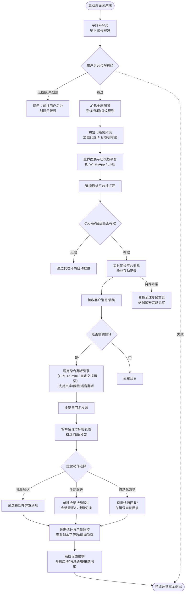

## 一、项目名称

**NexSCRM 桌面客户端**（版本号：1.0.7）

> 说明：这是一个桌面端应用程序（Electron架构），作为SaaS后台的客户端载体，支持**子账号登录**与**多平台聚合**。

## 二、项目背景（补充细化）

NexSCRM 不仅是一个单纯的社媒CRM，更是一个**集“环境隔离（防关联）”与“智能翻译沟通”于一体的海外营销客户端**。其核心背景逻辑如下：

1. **防关联与多账号矩阵**：海外营销人员需同时运营大量社媒账号（如WhatsApp、LINE、Signal等），但平台官方限制严格。NexSCRM 通过**独立代理环境 + 指纹隔离 + Cookie管理**，为每个账号提供独立的浏览器/网络指纹环境，从底层规避账号关联封禁风险。
2. **跨境沟通语言壁垒**：针对多语种客户，客户端内置**聚合翻译引擎**（支持GPT-4o-mini等AI线路 + 传统翻译），并提供**截图翻译、语音翻译**能力，消除沟通障碍。
3. **团队协作与权限分层**：支持主账号（在用户后台管理）创建**子账号**并分配不同平台权限，实现团队内部分工运营。
4. **稳定的全球网络基建**：内置 **“全球专线”** 与**安全加密链路**，保障在复杂网络环境下消息收发的低延迟（UI显示905ms）和高可用性。

## 三、核心端到端业务流程（完整故事线）

基于UI中的“代理设置”、“指纹设置”、“子账号登录”、“聚合翻译”、“粉丝洞察”、“群发消息”等组件，完整的端到端业务流如下：



## 四、系统模块交互与架构说明（细化）

结合客户端UI布局和后台逻辑，系统架构分为 **接入层、环境隔离层、业务功能层、配置层**。其中**代理与指纹模块是所有业务开展的前置依赖**。

```mermaid
flowchart LR
    subgraph 接入与通讯层
        A[全球专线模块<br>安全加密链路]
        B[子账号认证模块<br>权限/套餐校验]
    end

    subgraph 环境隔离层（核心底层）
        C[代理管理模块<br>支持自定义代理/全局代理]
        D[指纹与浏览器环境模块<br>UA/WebGL/随机指纹/Cookie]
    end

    subgraph 业务聚合层
        E[多平台适配器<br>WhatsApp/LINE/Signal等]
        F[消息引擎<br>收发/路由/置顶/快捷键]
        G[聚合翻译引擎<br>GPT-4o/截图翻译/语音翻译]
        H[客户管理模块<br>粉丝洞察/备注/标签/统计]
        I[营销自动化模块<br>快捷回复/群发消息]
    end

    subgraph 配置与监控层
        J[全局配置中心<br>显示/系统/代理/翻译预设]
        K[用量监控模块<br>剩余字符/翻译次数]
        L[客服与反馈模块<br>@nextkj / 意见反馈]
    end

    %% 调用关系与数据流向（关键）
    B -->|校验通过激活| C
    B -->|校验通过激活| D
    C -->|为E提供网络出口| E
    D -->|为E提供隔离指纹| E

    E -->|接收原始消息| F
    F -->|需翻译时触发| G
    G -->|回传译文| F
    F -->|生成客户数据| H
    H -->|筛选受众| I
    I -->|调用F发送群发| F

    J -->|覆盖默认参数| C
    J -->|覆盖默认参数| D
    J -->|覆盖默认参数| G

    F -->|记录消耗| K
    H -.->|数据持久化| M[(后台云端数据库)]
    K -.->|同步余额| M

    L -->|提交Bug/建议| N[开发团队后台]
```

### 核心模块职责与边界说明：

| 模块                     | 核心职责                                                                                                           | 关键依赖/事务边界                                                                                                                 |
| :----------------------- | :----------------------------------------------------------------------------------------------------------------- | :-------------------------------------------------------------------------------------------------------------------------------- |
| **子账号认证模块**       | 校验登录权限、拉取该子账号被授权的平台列表（截图中的“请先在用户后台子账号管理中创建子账号”）。                     | **依赖**：用户后台主账号配置。<br>**边界**：仅负责鉴权，不负责账号的社媒平台登录状态。                                            |
| **代理管理模块**         | 支持全局代理和单会话独立代理（HTTP/Socks），具备“智能填写”和“检查代理服务器”功能。                                 | **被依赖**：所有平台适配器启动时必须调用本模块获取网络出口。<br>**边界**：只提供网络路由，不修改业务数据。                        |
| **指纹与浏览器环境模块** | 生成独立的浏览器指纹（截图含“随机版本”、“一键生成随机指纹”），管理Cookie隔离。                                     | **被依赖**：多平台适配器初始化Web容器时必须注入。<br>**边界**：指纹数据与本地会话绑定，退出即销毁（可选持久化）。                 |
| **聚合翻译引擎**         | 统一封装AI提示语（支持自定义）、翻译线路切换（如GPT-4o-mini）、源/目标语言设置，并支持“截图翻译”和“独立翻译”开关。 | **被依赖**：消息引擎在发送/接收时调用。<br>**边界**：纯功能性模块，不存储翻译记录（除非开启字符优化）。                           |
| **多平台适配器**         | 对接各社交平台底层协议，通过预置的代理+指纹发起连接。UI支持“自定义左侧栏平台展示顺序”。                            | **依赖**：代理、指纹、全局配置。<br>**边界**：只做协议适配，具体业务逻辑（如群发限频）由上层模块控制。                            |
| **营销自动化模块**       | 包含“快捷回复”预设、“群发消息”任务。                                                                               | **依赖**：客户管理模块获取粉丝列表；消息引擎进行实际下发。<br>**事务边界**：群发任务具有事务性（成功/失败记录），不阻塞其他会话。 |
| **用量监控模块**         | 实时显示“今日剩余字符数（5000）”和“今日剩余翻译次数（无限）”。                                                     | **依赖**：翻译引擎和消息发送的实时回调扣减。<br>**边界**：只读展示+本地缓存，最终余额以云端为准（需联网同步）。                   |
